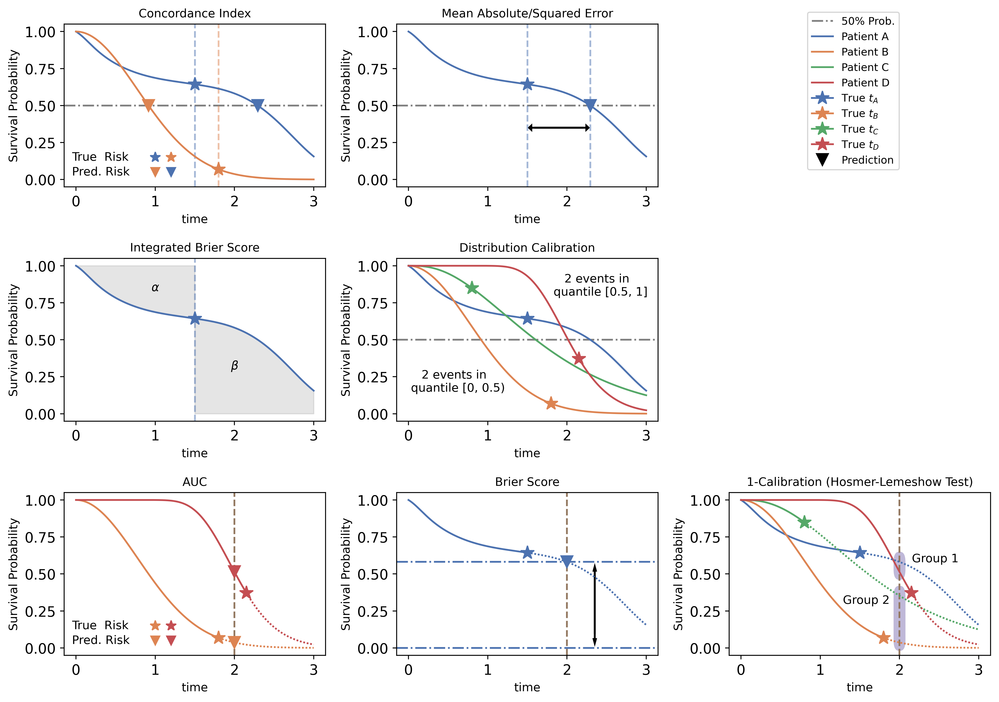

# SurvivalEVAL

<p align="center"></p>


-----------------

[](https://www.python.org/downloads/release/python-380/)
[](https://opensource.org/licenses/MIT)
[](https://github.com/shi-ang/SurvivalEVAL/issues)
[](http://hits.dwyl.com/shi-ang/SurvivalEVAL)


This python-based package contains the most completeness evaluation methods for Survival Algorithms (see [paper](https://ojs.aaai.org/index.php/AAAI-SS/article/view/27713)). 
These evaluation metrics can be divided into 3 categories:
- For point prediction (first row in the figure below)
    - [Concordance Index](#concordance-index)
    - [MAE](#mean-absolute-error) 
    - [MSE](#mean-squared-error)
- For survival distribution prediction (second row in the figure below)
    - [IBS](#integrated-brier-score-ibs)
    - [D-Calibration](#distribution-calibration-d-calibration)
- For single time probability prediction (third row in the figure below)
    - [AUROC](#area-under-the-receiver-operating-characteristic-auroc)
    - [BS](#brier-score-bs)
    - [1-Calibration](#one-time-calibration-1-calibration)



## Concordance index
Concordance index identifies the “comparable” pairs of patients and calculates the percentage of correctly ranked pairs to assess a survival model’s performance. 
Given two predicted survival curves of a paired patients, it compares the predicted median/mean survival times and marks that pair as correct if the model's prediction about who died first matches with the reality. 

## Mean Absolute Error
One straightforward metric would be “MAE” –  the absolute difference between the actual and predicted survival times (e.g. median of a curve).
This requires using the “actual survival time”, which is trivial for uncensored instances, but problematic for censored individuals. 
This python package implemented MAE loss metrics using different ways of handling censored instances. Here we list three of them:
1. `Uncensored` simply discards all the censored individuals and compute the MAE for all the uncensored instances.
2. `Hinge` calculates the early prediction error. For a censored instance, if the predicted survival time is smaller than the censored time, then `l1_loss = censor_time - predict_time`. If the predicted survival time is equal or larger than the censored time, then `l1_loss = 0`. 
3. `Pseudo_obs` “de-censors” the censored patients, using pseudo-observation method (by estimating the contribution of a censored subject to the whole Kaplan-Meier distribution). Then it calculates the MAE between de-censoring time and the predicted survival time, just like the normal way.


## Mean Squared Error
Mean squared error (MSE) is another metric to measure the difference between the actual and predicted survival times.
Similar to MAE, mean squared error (MSE) also has multiple ways to handle censored instances.
1. `Uncensored`
2. `Hinge`
3. `Pseudo_obs`

We also have root mean squared error (RMSE) for each of the different ways.

## Integrated Brier Score (IBS)
IBS measures the squared difference between the predicted survival curve with the Heaviside step function of the observed event.
IBS can be viewed as the integration of the (single-time) Brier score across all the time points. 
A smaller IBS value is preferred over the larger value. 
This python implementation uses IPCW weighting to handle the censored instances. Please refer to [Assessment and Comparison of Prognostic Classification Schemes for Survival Data](https://pubmed.ncbi.nlm.nih.gov/10474158/) for the detail of IPCW weighting.
Please also note that IBS is also identical to the [Continuous Ranked Probability Score(CRPS)](https://arxiv.org/abs/1806.08324), except for the IPCW weighting.

## Distribution Calibration (D-calibration)
[Haider et al.](https://jmlr.org/papers/volume21/18-772/18-772.pdf) proposed distribution calibration (D-calibration) test for determining if a model that produces ISDs is meaningful. 
D-calibration splits the time-axis into a fixed number of intervals and compares the actual number of events with the predicted number of events within each interval. 
A well D-calibrated model is the one where the predicted number of events within each time interval is statistically similar to the observed number.
Models with p-value higher than 0.05 can be considered as well-calibrated model across the survival distribution.

D-calibration quantifies this comparison of predicted and actual events within each time interval. 
The details of D-calibration calculations and ways to incorporate censored instances into D-calibration computation appear in Appendix B and in [Effective Ways to Build and Evaluate Individual Survival Distributions](https://jmlr.org/papers/volume21/18-772/18-772.pdf).

## Area Under the Receiver Operating Characteristic (AUROC)
AUROC is a metric to measure the performance of a single time probability prediction. 
It is the area under the receiver operating characteristic curve, which is the plot of the true positive rate against the false positive rate at various threshold settings.
In the survival analysis, the single time probability prediction is the prediction of the survival probability at a specific time point.
And the true label is whether the patient died at that time point.
AUROC excludes the censored instances whose censoring time is earlier than the target time point.

## Brier Score (BS)
The Brier score, at a specific time-point, is computed as the mean squared error between the observed event (binary indicator variable) and the predicted event probability at that time-point. 
It is meaningful in the sense that the square root of the Brier score is the distance between the observed and predicted event on the probability scale. 


## One-time Calibration (1-calibration)
Calibration measures the confidence of the model. 
The detailed explanation for the algorithm implementation can be found in [Effective Ways to Build and Evaluate Individual Survival Distributions](https://jmlr.org/papers/volume21/18-772/18-772.pdf) and [A tutorial on calibration measurements and calibration models for clinical prediction models](https://academic.oup.com/jamia/article/27/4/621/5762806).
The output is a p-value of Hosmer-Lemeshow goodness-of-fit test at a target time. 
Models with p-value higher than 0.05 can be considered as well-calibrated model at that time.


## Installation
Clone the repo, cd into it and install it in editable mode (`-e` option).
That way, these are no more need to re-install the package after modification.
```bash
git clone https://github.com/shi-ang/SurvivalEVAL.git
cd SurvivalEVAL
pip install -r requirements.txt
pip install -e . 
```

## Quickstart Example

```python
from lifelines import CoxPHFitter
from lifelines.datasets import load_rossi

from Evaluator import LifelinesEvaluator

# Load the data
rossi = load_rossi()
rossi = rossi.sample(frac=1.0)

# Split train/test set
train = rossi.iloc[:300, :]
test = rossi.iloc[300:, :]
train_event_times = train.week.values
train_event_indicators = train.arrest.values
test_event_times = test.week.values
test_event_indicators = test.arrest.values

# Fit the model
cph = CoxPHFitter()
cph.fit(train, duration_col='week', event_col='arrest')

survival_curves = cph.predict_survival_function(test)

# Make the evaluation
eval = LifelinesEvaluator(survival_curves, test_event_times, test_event_indicators,
                          train_event_times, train_event_indicators)

cindex, _, _ = eval.concordance()

mae_score = eval.mae(method="Pseudo_obs")

mse_score = eval.mse(method="Hinge")

# The largest event time is 52. So we use 53 time points (0, 1, ..., 52) to calculate the IBS
ibs = eval.integrated_brier_score(num_points=53, draw_figure=True)

d_cal = eval.d_calibration()

# The target time for the single time probability prediction is set to 25
auc_score = eval.auc(target_time=25)
bs_score = eval.brier_score(target_time=25)
one_cal = eval.one_calibration(target_time=25)

```
See the [Examples](Examples) for more usage examples.


## Expected Deliveries in the Future
1. Publish the package to PyPI
2. Time-dependent c-index (by Antolini)
3. IPCW AUC

Please create an issue if you want me to implement any other evaluation metrics.

## Updates
- 2024-04-28: Add the non-IPCW-weighted Brier score and IBS.
- 2024-03-13: Remove the `rpy2` dependency. Now the package is pure python.


## Citing this work

We recommend you use the following to cite `SurvivalEVAL` in your publications:

```
@article{qi2024survivaleval,
year = {2024},
month = {01},
pages = {453-457},
title = {{SurvivalEVAL}: A Comprehensive Open-Source Python Package for Evaluating Individual Survival Distributions},
author={Qi, Shi-ang and Sun, Weijie and Greiner, Russell},
volume = {2},
journal = {Proceedings of the AAAI Symposium Series},
doi = {10.1609/aaaiss.v2i1.27713}
}
```